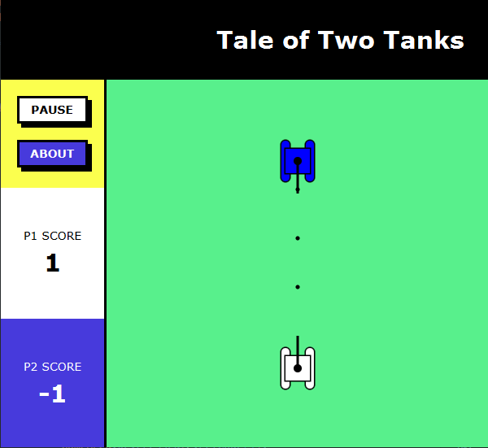

# Two Tanks

## Gameplay

The tank game we used to play as a child. Gameplay is super simple. Drive your tank and shoot at the other. Hitting the enemy increases your score by 1 and getting hit decreases your score by 1. First player to reach a certatin score (3 by default) wins the game.

## Development  (v.1.0)

* Written as a part of learning JavaFX in week 6 ~ 7 of CS_1102 course at UoPeople.
* Total time for coding, documentation, designing is around 13 hours.
* Spent four days from 2022 December 20 to 23.

## Code Structure

Game logic, UI and Data are separated into packages. The Main class sets the scene and launches the application. 
Packages are:

1. Data:
    NormalTank          Implementation that gives measurements for normal-size tanks.
    TankMeasurements    Abstract class for tank measurements.
    Sizes               Enum for layout measurements, expressed in numbers.
    Props               Other miscellenous measurements, which are not in numbers.

2. Logic:
    GameArea            Singleton class that builds canvas and drives game logic.
    Tank                Represents tanks. 
    Shell               Represents shells fired from the tank.

3. UI:
    LayoutBuilder       Provides root node (details provided in the class).

## Changing Game Settings

* Updating variables in the Data package is mostly enough to change measurements.
* Styles can be updated by editing style strings at the beginning of classes in LayoutBuilder class.
* Changing control keys can be done by updating `keyPressed(Keycode code)` method in GameArea class.

## Ideas for Expansion

* Single player mode against computer
* Smoother tank movements (accelerating, turning, etc.)
* Leaderboard of scores

## Current Issues

* Arrow keys do not work well when other focusable nodes (Button, HyperLink, etc.) are added (even when `setFocusTraversal(false);` is used).
* Two keys pressed (without releasing) seem to trigger only one key code.
* Player names and scores should be made into a separate class or morphed into tanks.
  
